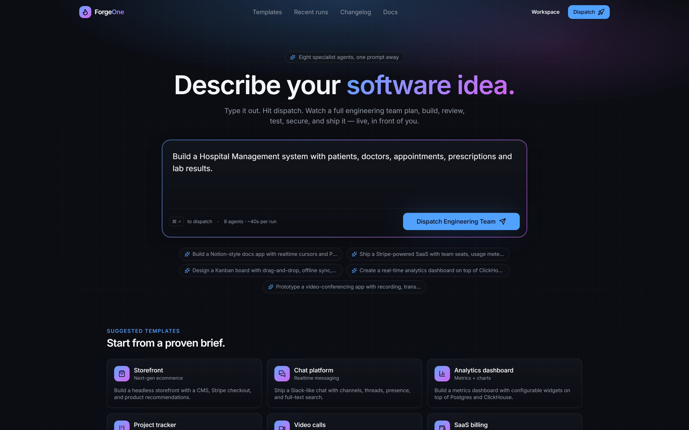

# The Solution

## ForgeOne runs a real engineering process

- One prompt in → a working repository out
- Eight specialist agents, executed in dependency order
- Every stage streams live so you watch the reasoning, not just the result

## Each agent has one job

| Agent | Owns |
|---|---|
| Product Manager | Domain model, epics, acceptance criteria |
| Architect | Entities, relationships, storage, topology |
| Developer | The repository itself |
| Reviewer | Checks against files that exist |
| Tester | Coverage and the gaps in it |
| Security | Severity-ranked findings |
| DevOps | Compose topology and rollout |
| Documentation | Index and execution summary |

## What makes it credible

- **No stage starts** until the artifacts it declares as inputs exist
- **Every number is measured**, never asserted
- **Model output is untrusted** and validated before it reaches you

