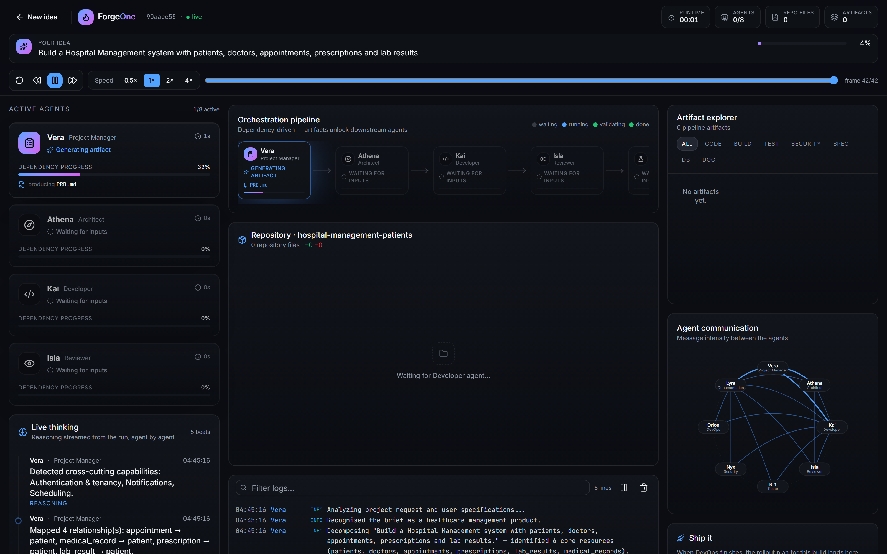

# How ForgeOne Works

## 1. Understand the prompt

- Nouns extracted directly from what you typed
- Domain scored against 19 profiles — chess, healthcare, commerce, research…
- Domain supplies what the sentence implies but omits

> "Build a Chess Platform" → `players, games, moves, ratings, tournaments, puzzles`

## 2. Build a shared blueprint

- Resources, typed fields, relationships
- Cross-cutting capabilities: realtime, auth, billing, search, storage, AI
- Written once to `SharedContext` — every downstream agent reads the same model

## 3. Generate the repository

- One route module per resource, Zod-validated
- SQL schema with real foreign keys, cascades and indexes
- Config, Dockerfile, tests, README

## 4. Review what was actually produced

- Reviewer, Tester, Security, DevOps and Documentation read the emitted files
- No templates, no assumptions, no references to ForgeOne itself

