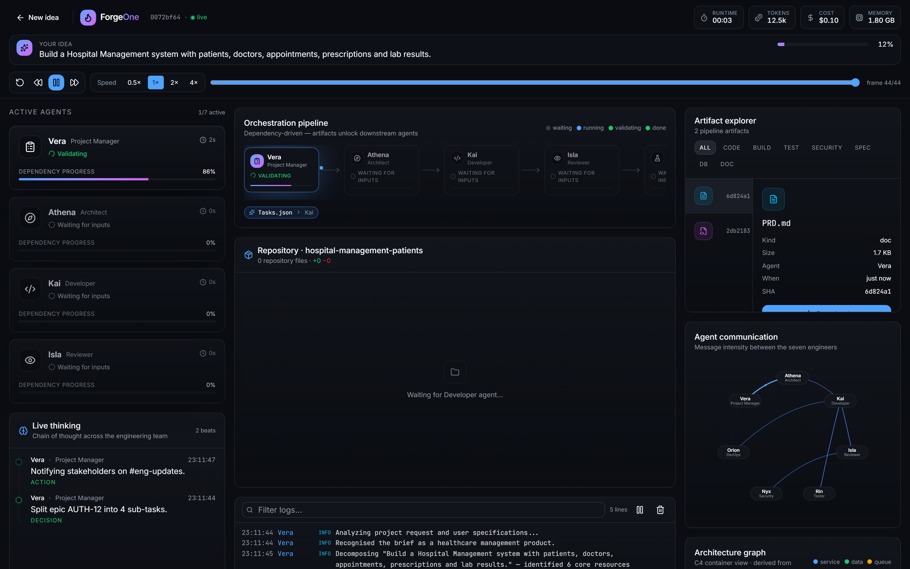
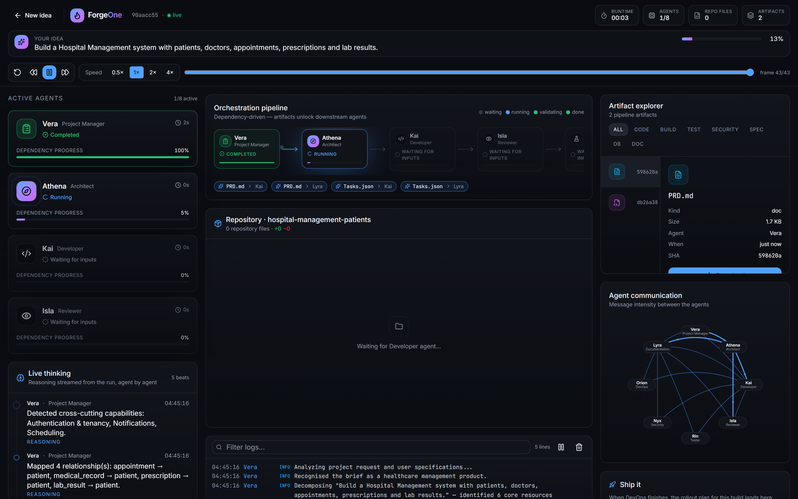

# The Agent Pipeline

## Dependency-gated, not sequential-by-luck

- Each stage declares required **artifact types**
- The pipeline refuses to start a stage until they exist
- A missing dependency fails the run loudly instead of producing nonsense

```
Product Manager ──► PRD.md, Tasks.json
        ↓
Architect ────────► Architecture.md
        ↓
Developer ────────► 19 source files + Repository.zip
        ↓
Reviewer ─────────► PRReview.md
Tester ───────────► TestReport.md
Security ─────────► SecurityAudit.md
DevOps ───────────► DeploymentPlan.md
Documentation ────► ProjectOverview.md, SummaryReport.md
```

## Five states per agent, streamed live

`WAITING_FOR_INPUT → RUNNING → GENERATING_ARTIFACTS → VALIDATING → COMPLETE`

## Why it streams

- The pipeline is CPU-only and finishes in ~8 ms
- Pacing meters *event emission*, never the work
- Result: a ~42 second run you can actually watch



