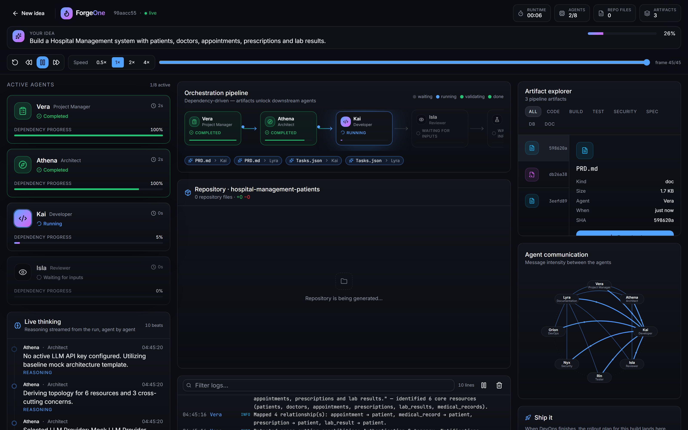
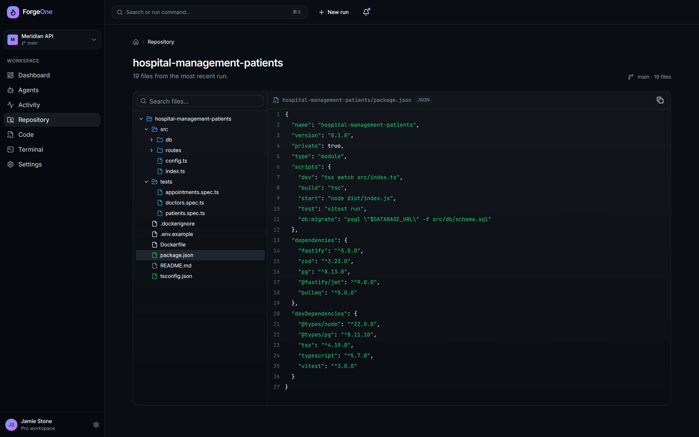

# Live Demo

## The prompt

> "Build a Hospital Management system with patients, doctors, appointments, prescriptions and lab results."

## What the Product Manager says, out loud

```
Recognised the brief as a healthcare management product.
Identified 6 core resources
  (patients, doctors, appointments, medical_records, prescriptions, lab_results).
Mapped 4 relationships:
  appointment → patient, medical_record → patient,
  prescription → patient, lab_result → patient.
Detected capabilities: Authentication & tenancy, Notifications.
```

## What the Developer produces

```
src/routes/patients.ts          src/routes/appointments.ts
src/routes/doctors.ts           src/routes/prescriptions.ts
src/routes/medical_records.ts   src/routes/lab_results.ts
src/db/schema.sql               src/db/client.ts
src/config.ts  src/index.ts  tsconfig.json  .env.example
Dockerfile  .dockerignore  README.md  package.json  tests/
```

**19 repository files · 29 pipeline artifacts · Repository.zip**



