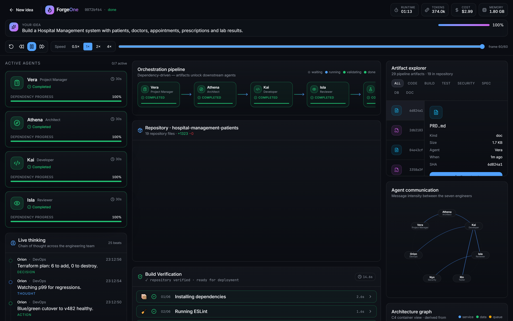

# Technical Highlights

## Semantic domain modelling

- Noun extraction from the prompt — works for domains nobody anticipated
- 19 scored domain profiles supply what the sentence implies
- Two-point threshold stops an incidental word hijacking the model

## Real relational output

- Foreign keys inferred, then materialised as actual columns
- `create table` emitted **parent-first** so references resolve
- Index on every foreign key — because the list endpoints filter on exactly those

## Dependency-gated orchestration

- Artifact-type contracts between stages
- Immutable, versioned artifact graph with provenance
- Consumers recorded per artifact

## Counts that mean one thing

- `inRepository` flag set only on files the Developer bundles
- **Invariant, asserted by test:** zip entries === artifacts flagged `inRepository`
- Console, explorer, build panel and download always agree

## Streaming without faking

- Agent events buffered, then replayed at pacing speed
- Timestamps stamped at replay, so the log reads as a genuine stream
- `IAgent` interface untouched — no agent knows pacing exists

