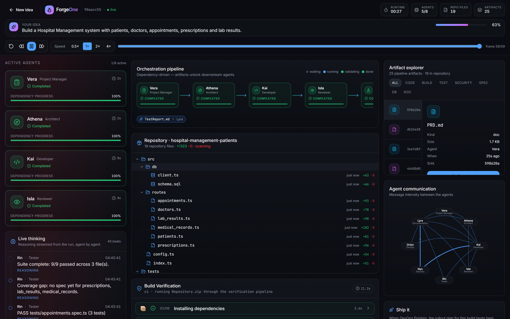

# Security

## We found Zip Slip in our own pipeline

Model output went straight into the archive. A plausible malformed response produced:

```
../../../../etc/cron.d/backdoor
C:\Windows\System32\drivers\etc\hosts
src/../../escape.ts
src/routes/users.ts        ← twice
```

`Repository.zip` is handed to a user to **extract**. That is a real archive-extraction vulnerability, not a theoretical one.

## The fix: one choke point

`orchestrator/repository-guard.ts`

- Separators unified, traversal evaluated **after** normalisation
- Absolute paths rejected — Unix, drive letters and UNC
- Control characters, Windows-illegal characters, reserved device names
- Trailing dot/space segments — Windows strips them and entries collide
- Duplicates rejected **case-insensitively**
- Per-file, total-byte, path-length and file-count budgets

**Result: 7 hostile paths in → 1 safe entry out.**

## Defence in depth

- The zip writer re-validates independently — no caller can bypass the policy
- Fixed alongside: the archive header declared more entries than it wrote, which readers report as corruption

## The Security agent reports honestly

- An unauthenticated CRUD service is **not** "0 vulnerabilities"
- Findings are driven by detected capabilities — billing gets the webhook-signature finding, realtime gets the WebSocket-origin finding


