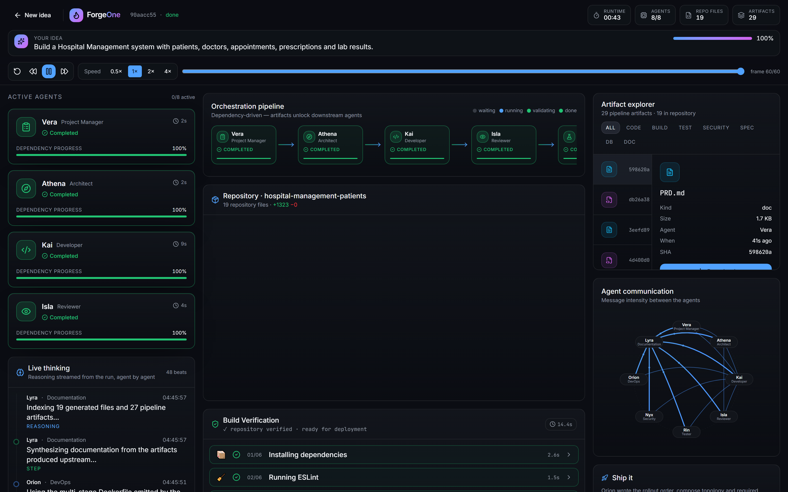

# Verification

## Gates on every commit

| Gate | Result |
|---|---|
| `pnpm turbo lint` | 5/5 tasks — **0 errors** |
| `pnpm turbo type-check` | 8/8 tasks |
| `pnpm turbo test` | **118 tests**, 10 files |
| `pnpm turbo build` | 5/5 tasks |

## Properties asserted end-to-end, not just unit-tested

**Archive integrity**
- Zip entries === artifacts flagged `inRepository`
- Header count === entries actually written
- Verified across 6 prompts: **6/6**

**Provider safety**
- Hostile response → traversal 0, absolute 0, duplicates 0
- Falls back to the deterministic scaffold when output is unusable

**Prompt diversity** — across 10 domains
- Distinct route surfaces **10/10**
- Distinct architectures **6/6**
- Distinct documentation **6/6**
- Integrity problems **0**

## Cross-agent integrity

- Reports citing files that do not exist: **0**
- Docs citing routes that do not exist: **0**
- ForgeOne self-references leaking into generated artifacts: **0**

