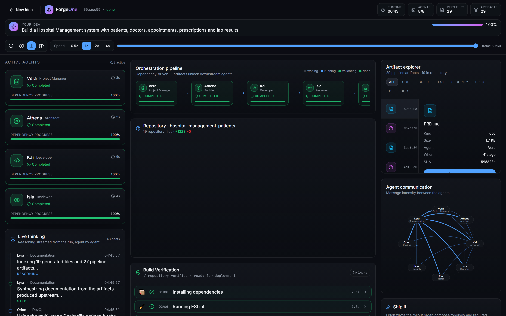

# Results

## From one sentence, in ~42 seconds

- **19** repository files
- **29** pipeline artifacts
- **9** generated test cases
- **1** downloadable, valid `Repository.zip`

## Ten domains, ten different systems

| Prompt | Resources generated |
|---|---|
| Chess Platform | players, games, moves, ratings, tournaments, puzzles |
| Hospital Management | patients, doctors, appointments, medical_records, prescriptions, lab_results |
| Research Platform | papers, datasets, experiments, models, benchmarks, runs |
| E-Commerce | products, orders, customers, inventory_items, payments, reviews |
| Netflix clone | titles, episodes, profiles, watchlists, view_events, subscriptions |
| Resume Builder | resumes, templates, sections, skills, exports |
| Project Tracker | issues, cycles, roadmaps, projects, comments, labels |
| CRM | contacts, companies, deals, activities, pipeline_stages |
| Video Meetings | meetings, participants, recordings, transcripts |
| Analytics | events, dashboards, widgets, queries, data_sources |

## Every number on screen is measured

- Repository count === entries in the download
- Test count parsed from the specs that were generated
- Digest derived from file content
- Run id is the real run id

